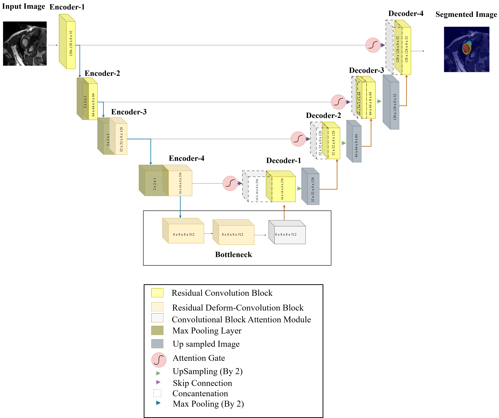
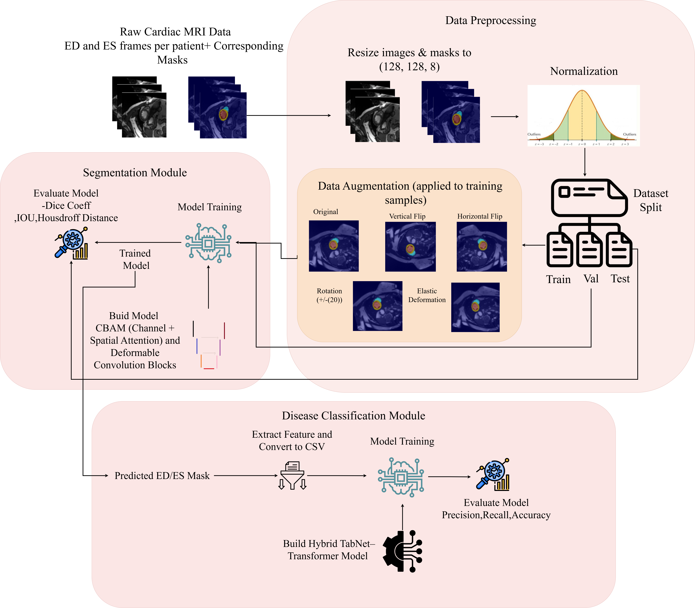
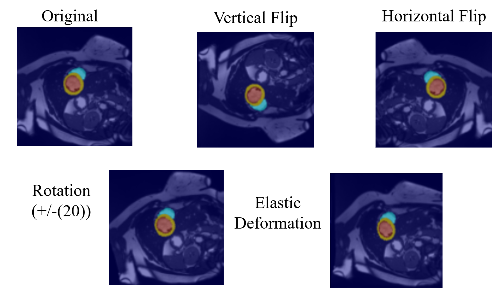
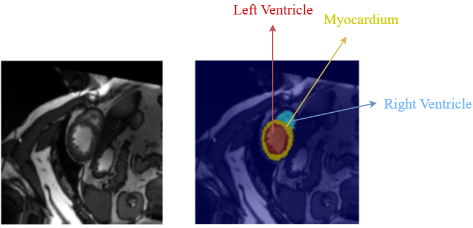
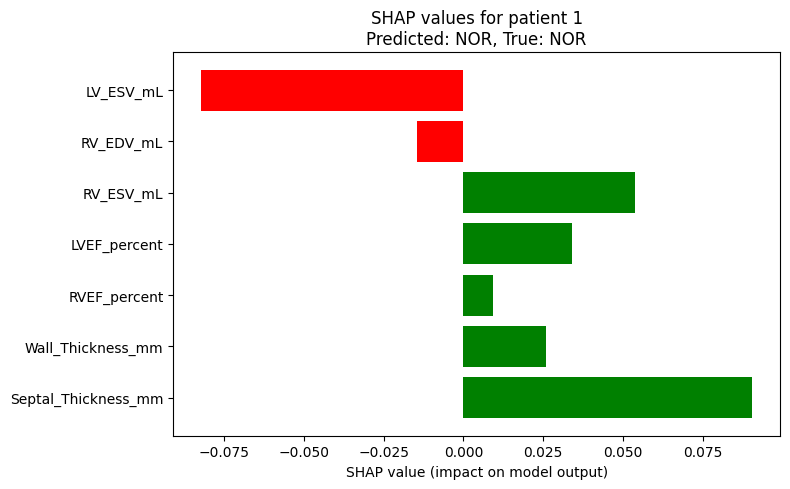

#  Cardiac MRI Segmentation & Disease Prediction using Explainable AI

##  Overview

This project presents an end-to-end deep learning framework for automated cardiac MRI segmentation, quantitative biomarker extraction, and cardiac disease prediction using the **ACDC (Automated Cardiac Diagnosis Challenge)** dataset.

The framework combines:

- Modified 3D U-Net Architecture
- Deformable Convolution Layers
- CBAM Attention Mechanism
- Explainable AI (SHAP & Grad-CAM)
- Hybrid TabNet–Transformer Classification

The system automatically segments:
- Left Ventricle (LV)
- Right Ventricle (RV)
- Myocardium

The segmented masks are further used to extract clinically relevant biomarkers for downstream cardiac disease classification.

---

#  Key Features

✅ Automated Cardiac MRI Segmentation  
✅ Modified 3D U-Net Architecture  
✅ Deformable Convolution Integration  
✅ CBAM Attention Mechanism  
✅ Clinical Biomarker Extraction  
✅ Hybrid TabNet–Transformer Classification  
✅ Explainable AI using SHAP & Grad-CAM  
✅ End-to-End Disease Prediction Pipeline  
✅ High Dice Score (~0.93)

---

# 🧠 Technologies Used

| Category | Tools / Frameworks |
|---|---|
| Programming Language | Python |
| Deep Learning | TensorFlow, Keras |
| Computer Vision | OpenCV |
| Explainable AI | SHAP, Grad-CAM |
| Visualization | Matplotlib |
| Dataset | ACDC Cardiac MRI Dataset |

---

# 📂 Project Structure

```bash
Cardiac-Segmentation/
│
├── notebooks/
│   ├── Data_Preprocessing.ipynb
│   ├── Model_Developement.ipynb
│   └── Model_Evaluation.ipynb
│
├── images/
│   ├── architecture_diagram.png
│   ├── Final_block_diagram.png
│   ├── sample.png
│   ├── shap.png
│   └── annotation.png
│
└── README.md
```

---

#  Model Architecture

The proposed segmentation framework is based on a modified **3D U-Net** architecture enhanced with:

- Deformable Convolution Layers
- CBAM Attention Modules
- Attention-guided Skip Connections
- Multi-scale Feature Fusion

The model is designed to improve segmentation accuracy by adaptively learning irregular cardiac boundaries and refining clinically relevant structures.

---

#  Architecture Diagram

The architecture combines deformable convolution blocks and CBAM attention modules to improve boundary localization and feature refinement for cardiac MRI segmentation.



---

#  Workflow / System Pipeline

The complete workflow includes:

1. MRI Image Acquisition  
2. Data Preprocessing & Augmentation  
3. Cardiac Structure Segmentation  
4. Clinical Biomarker Extraction  
5. Disease Prediction  
6. Explainable AI Analysis

---

#  Block Diagram

The following block diagram illustrates the complete end-to-end workflow of the proposed framework.



---

#  Sample Input & Annotation

##  Sample MRI Image

Example cardiac MRI slice from the ACDC dataset.



---

##  Ground Truth Annotation

Expert annotated segmentation masks for:
- Left Ventricle (LV)
- Right Ventricle (RV)
- Myocardium



---

#  Cardiac Biomarker Extraction

After segmentation, the predicted masks are used to automatically extract patient-specific cardiac biomarkers.

##  Extracted Biomarkers

- End Diastolic Volume (EDV)
- End Systolic Volume (ESV)
- Stroke Volume (SV)
- Ejection Fraction (EF)
- Myocardial Wall Thickness
- Septal Thickness

These biomarkers capture both structural and functional cardiac properties and are used for downstream disease prediction.

---

#  Sample Extracted Biomarker Table

| Patient ID | Target | LV EDV (mL) | LV ESV (mL) | RV EDV (mL) | RV ESV (mL) | LVEF (%) | RVEF (%) | Wall Thickness (mm) | Septal Thickness (mm) |
|---|---|---|---|---|---|---|---|---|---|
| patient001 | DCM | 80.74 | 62.01 | 41.55 | 19.14 | 23.19 | 53.94 | 3.59 | 3.85 |
| patient002 | DCM | 58.95 | 43.35 | 19.42 | 9.10 | 26.47 | 53.13 | 3.65 | 4.36 |
| patient003 | DCM | 58.47 | 52.49 | 49.10 | 45.31 | 10.23 | 7.71 | 3.65 | 3.59 |

---

#  Disease Classification Module

A hybrid **TabNet–Transformer** architecture is used for cardiac disease classification.

## 🔹 TabNet
- Attentive feature selection
- Sparse feature learning
- Improved interpretability

## 🔹 Transformer Encoder
- Self-attention mechanisms
- Long-range dependency learning
- Relationship modeling between biomarkers

The hybrid architecture combines interpretability with high representational capability for distinguishing overlapping cardiac pathologies.

---

# ❤️ Target Cardiac Diseases

The framework is designed to classify:

- Dilated Cardiomyopathy (DCM)
- Hypertrophic Cardiomyopathy (HCM)
- Myocardial Infarction (MINF)
- Right Ventricular Abnormality (RVA)

---

# 🔍 Explainable AI

To improve model transparency and interpretability, Explainable AI techniques are integrated into the framework.

The project uses:
- SHAP Analysis

---

# 🟣 SHAP Feature Importance Analysis

SHAP is used to analyze the contribution of extracted biomarkers toward disease prediction.



---

# 📊 Performance Metrics

| Metric | Score |
|---|---|
| Dice Score | ~0.93 |
| Disease Classification Accuracy | 88% |


#  Research Contributions

This work demonstrates:
- Advanced cardiac MRI segmentation
- Automated clinical biomarker extraction
- Explainable AI integration in healthcare
- Attention-based deep learning
- Hybrid deep learning classification
- End-to-end AI-powered cardiac analysis

